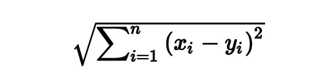

It is often useful to measure objects not in terms of their quantity but in terms of
some quality. We frequently represent this qualitative information as an
observation’s membership in a discrete category such as gender, colors, or brand
of car. However, not all categorical data is the same. Sets of categories with no
intrinsic ordering is called nominal.

Examples of nominal categories include:
- Blue, Red, Green
- Man, Woman
- Banana, Strawberry, Apple

In contrast, when a set of categories has some natural ordering we refer to it as ordinal. For example:
- Low, Medium, High
- Young, Old
- Agree, Neutral, Disagree

Furthermore, categorical information is often represented in data as a vector or
column of strings (e.g., "Maine", "Texas", "Delaware"). The problem is that
most machine learning algorithms require inputs be numerical values

The k-nearest neighbor algorithm provides a simple example. One step in the
algorithm is calculating the distances between observations—often using
Euclidean distance:

where x and y are two observations and subscript i denotes the value for the
observations’ ith feature. However, the distance calculation obviously is impossible if the value of xi
is a string (e.g., "Texas"). Instead, we need to
convert the string into some numerical format so that it can be inputted into the
Euclidean distance equation.

Our goal is to make a transformation that properly
conveys the information in the categories (ordinality, relative intervals between
categories, etc.).